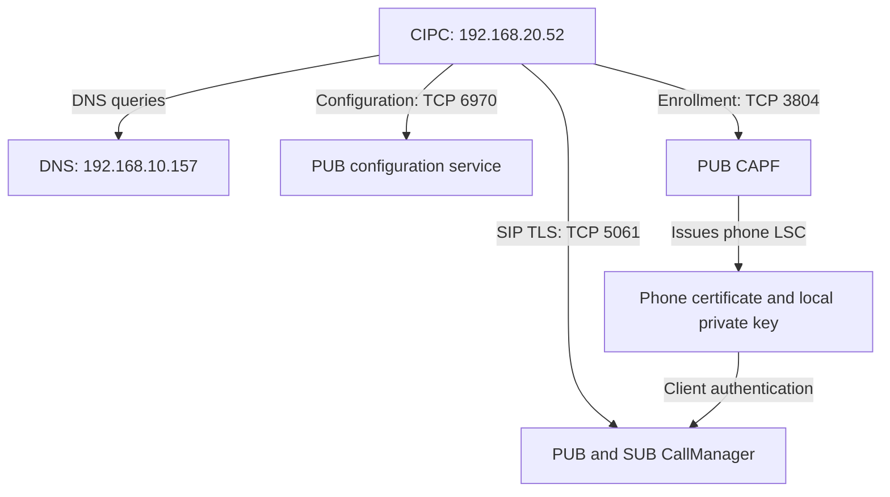

# SIP over TLS with CISCO IP Communicator

A standalone SIP/TLS learning repository reconstructed from the September 2026 HQ India lab. Start here even if you have never read the separate UDP repository.

**Result:** after installing its LSC, CIPC completed mutual TLS handshakes with PUB and SUB and exchanged encrypted application data. The operator reported successful registration. The encrypted capture alone does not reveal REGISTER/200 OK, establish the active node, or prove SRTP audio.

**Compatibility boundary:** this is observed interoperability of legacy CIPC 8.6.6.0 on Windows 11 with CUCM 14. It is not a supported-platform certification or a modern production security recommendation. The captured connection negotiated TLS 1.0 and an RSA/CBC cipher. Do not weaken an existing production cluster to reproduce it; use an isolated legacy lab or a supported modern endpoint.

## Begin here — do these in order

1. [Prepare network, routing, time, device pool and user](docs/00-foundation.md).
2. [Run CLI checks; decide whether mixed mode is needed; verify PUB/SUB](docs/08-command-runbook.md).
3. [Understand CAPF 3804, HTTP 6970, CTL and LSC](docs/09-capf-trust-and-ports.md).
4. [Create/apply the security profile, phone, line and CAPF operation](docs/01-deployment.md).
5. Launch with capture running, submit LSC authentication string, then follow the failure/success cases below.
6. [Check coverage of the original work and evidence limits](docs/10-session-coverage.md).

**CAPF uses TCP 3804 in this lab—not 3084.** Mixed mode and CTL prepare cluster trust; enrollment separately installs the phone LSC; SIP TLS separately connects to 5061.

## Learning path

| Read in order | What you will learn |
|---|---|
| [1. Deployment, with field-by-field purpose](docs/01-deployment.md) | Network, CUCM objects, mixed mode, phone profile, CAPF enrollment and final checks |
| [2. Ports and technical glossary](docs/02-ports-and-glossary.md) | CAPF, LSC, CTL, CTI, TLS, SIP and the roles of each port |
| [3. Failed enrollment-state case](docs/03-failed-case.md) | Why a downloaded secure configuration still produced a plain TCP REGISTER and 403 |
| [4. Successful TLS case](docs/04-success-case.md) | How client certificates, CertificateVerify and Finished establish mutual TLS |
| [5. Wireshark workbook](docs/05-wireshark-workbook.md) | Filters, packet reading, test questions and troubleshooting decisions |
| [6. Operations and recovery](docs/06-operations.md) | Reboots, failover, port conflicts, renewal and evidence collection |
| [Sources and evidence boundaries](docs/07-sources.md) | Cisco, IANA, Wireshark and what was actually observed |

## Lab identity map

| Component | Value used in this guide |
|---|---|
| PUB / configuration server / CAPF | cucm-pub.ccie.collab — 192.168.10.150 |
| SUB / alternate call processor | cucm-sub.ccie.collab — 192.168.10.151 |
| AD/DNS | 192.168.10.157 |
| PC3 | HQ-PC3-TLS — 192.168.20.52/24 |
| Gateway | 192.168.20.1 |
| Generic MAC | **02:00:00:00:03:01** — example only |
| Generic CUCM device name | **SEP020000000301** — example only |
| User / line | ONPREM / 2103 in PT-HQ-INTERNAL |
| Device pool / group | DP-HQ-INDIA / CMG-HQ-LAB |
| Final profile | SIP-Profile-TLS-Encrypted |

Use your own stable adapter identity when configuring a real phone. MAC → remove separators → prefix SEP. The example MAC is locally administered and is not the original adapter MAC.

## What has been anonymized

Every new device MAC/name, certificate subject device identity, issuer identifier, certificate serial, fingerprint/hash and authentication-string example is synthetic or omitted. The lab IPs, object names and ONPREM label are retained for continuity. Raw PCAPs, screenshots, certificate files, PINs and private keys are not published.

The [failure example](examples/failure.json) and [success example](examples/success.json) are **teaching records, not importable certificates or configuration files**. A missing LSC has no certificate serial or fingerprint; inventing a “failed certificate value” would misrepresent the evidence.

Frame numbers in the case studies refer to the two private source captures. They are not universal Wireshark packet numbers. Students can reproduce the sequence with their own capture using the workbook filters.

## Architecture



CAPF enrollment, configuration download, and SIP registration are different conversations. CTIManager is not in this phone-to-CallManager TLS path.


---

## Continue here: CIPC-TLS Wireshark profile and the enrollment-to-registration story

This continuation keeps the architecture and all existing material above intact. It brings the new profile, comparison, teaching story and filters onto this same scrolling page. Existing detailed deployment documents remain linked above.

The two reattached captures were inspected for this continuation. The failure file has **6,071 frames**, the success file **2,317 frames**. Frame references below apply to those files only. Whole-file first-to-last packet spans in the reattached copies are approximately **576.232 seconds** and **157.410 seconds** respectively; these supersede the shorter duration figures in the earlier linked case summaries. Their referenced teaching frames still align.

No raw captures, certificates, authentication strings, screenshots or real MAC-derived identifiers are published.

### What changed, and what is proven?

**LSC enrollment was the key observed correction.** “Adding LSC values” means entering the private CAPF authentication string to authorize enrollment, then installing the phone's certificate. It does not mean manually typing a certificate fingerprint or using the string as a SIP password.

| Question | Failure capture/state | Success capture/state |
|---|---|---|
| Downloaded configuration | Encrypted intent: deviceSecurityMode 3, transportLayerProtocol 3, control port 5061 | Same relevant secure settings |
| Configuration certHash | Empty | Nonempty; value withheld |
| Phone certificate | Earlier phone display: LSC Not Installed | Client presents a CAPF-issued RSA 2048-bit certificate |
| CAPF traffic | No captured TCP 3804 traffic | CAPF TLS exchanges on TCP 3804 |
| Actual SIP transport | Readable REGISTER on TCP 5060 | TLS connections on TCP 5061 |
| Server response | 403: expected TLS, received TCP/UDP | Completed mutual TLS and protected application data |
| Registration status | Rejected in the displayed exchanges | Operator confirmed registration |
| Voice media encryption | Not established | Still not established by this registration capture |

The configuration was already requesting secure operation before enrollment. Changing Authenticated/Encrypted mode alone does not install an LSC. These are before/after observations, not a claim that every other internal state remained identical.

**Authentication, signaling encryption and media encryption are separate checks.** The observed AES cipher establishes encryption of the signaling connection. LSC installation alone does not prove that a subsequent call uses SRTP. The final observed configuration is **Encrypted**, while an earlier screenshot temporarily showed **Authenticated**. Do not combine these different moments into one state.

## A. Build the CIPC-TLS profile

1. Open the success capture in Wireshark.
2. Go to **Edit → Configuration Profiles**.
3. Copy your **CIPC-TCP** profile, or copy Default if it is unavailable.
4. Name it **CIPC-TLS**.
5. Set time display to **Seconds Since Beginning of Capture**.
6. Under **Preferences → Protocols → TCP**, retain sequence analysis, relative sequence numbers and subdissector stream reassembly.
7. Under TLS preferences, enable record/application-data reassembly options where offered.
8. If TCP 5061 or CAPF 3804 is not decoded as TLS, select an appropriate packet and use **Analyze → Decode As → TLS** for the relevant TCP port.

Do not globally decode every TCP port as TLS. Keep plain failure traffic on 5060 readable as SIP and configuration traffic on 6970 as HTTP.

### Useful columns

Keep No., Time, Source, Destination, Protocol and Info. Add or retain:

| Column title | Field | Read it as |
|---|---|---|
| Source port | tcp.srcport | Client ephemeral port or server service port |
| Destination port | tcp.dstport | Destination service/socket |
| TCP stream | tcp.stream | One connection, not a whole phone's lifetime |
| TCP payload | tcp.len | Bytes after the TCP header, including TLS overhead |
| Relative SEQ | tcp.seq | Start of this direction's byte range |
| Relative ACK | tcp.ack | Next byte expected in the opposite direction |
| Calculated window | tcp.window_size | Advertised receive capacity after scaling |
| Display delta | frame.time_delta_displayed | Gap since previous displayed frame |
| TLS record type | tls.record.content_type | Handshake, alert, application data, etc. |
| TLS handshake type | tls.handshake.type | ClientHello, certificate, and other visible handshake messages |
| TLS record length | tls.record.length | Record body length, excluding the five-byte record header |
| TLS alert | tls.alert_message.desc | Alert description, only when visible/decrypted |

A frame can contain several TLS records or handshake messages; these columns may show multiple values. Conversely, a record can span multiple TCP segments.

TCP still handles reliable byte delivery, acknowledgments, retransmission and receive windows. TLS adds security above TCP. A TCP ACK is not a TLS authentication verdict or SIP registration acceptance.

## B. Failure walkthrough: secure instructions, insecure registration attempt

Open the failure capture and begin with the PC3/PUB filter from section E.

| Frame(s) | What to inspect | What it establishes |
|---|---|---|
| 1646–1648 | TCP handshake to PUB 6970 | Configuration service is reachable |
| 1649, 1651 | CTL request and HTTP success | Trust-list bytes were delivered |
| 1667–1668 and following body | Signed device configuration | Secure intent existed before successful enrollment |
| 2997 / 2998 | Attempts to PUB/SUB TCP 5060 | Client selected the plain SIP destination |
| 3003 | Readable REGISTER to PUB | Via identifies TCP; this is not encrypted SIP |
| 3005 | 100 Trying | Provisional processing |
| 3008 | 403 Forbidden and Warning header | Explicit transport/security mismatch |
| 3257 / 3263 | Another PUB request/rejection | Failure repeats |
| 3268 / 3272 | SUB request/rejection | Another node enforces the same policy |

Sanitized teaching excerpt:

```text
SIP/2.0 403 Forbidden
Warning: 399 CUCM-PUB "Device security mismatch: expected TLS, received TCP/UDP"
```

No TCP 3804 or TCP 5061 packets occur in this failure file. This is **not a captured TLS handshake failing with an expired certificate**: the visible rejection is a plain-SIP security mismatch. Missing-LSC status comes from the earlier phone display, supported by the empty configuration certHash.

The absence of enrollment traffic applies to the captured interval; it does not prove the PC could never reach CAPF. Do not diagnose a wrong authentication string, untrusted CA or expired LSC without evidence of that particular condition.

### The correction already performed

The earlier deployment steps remain the authoritative setup path. For this specific recovery:

1. Confirm the correct phone record and CAPF service Started on PUB.
2. Under the phone's CAPF settings, select **Install/Upgrade**, **By Authentication String**, and a valid future operation deadline.
3. Generate the private authentication string, then Save/Apply Config as required.
4. On CIPC, open **Settings → Security Configuration → LSC → Update**; unlock settings with **\*\*#** if required.
5. Enter the generated string privately.
6. Verify **LSC Installed** and the CUCM CAPF operation status.
7. Allow the phone's reload/reconnection, then inspect TLS on 5061 and CUCM registration.

The enrollment string, end-user PIN, LSC public certificate and private key are different things. Do not publish any actual enrollment secret, device certificate identity or key.

## C. Success walkthrough: three separate conversations

### C1. CAPF gives the phone its identity certificate — TCP 3804

| Frame(s) | Exchange | Meaning |
|---|---|---|
| 363–365 | SYN, SYN/ACK, ACK: PC3:56148 ↔ PUB:3804 | TCP transport becomes available |
| 366 | ClientHello | Client offers TLS capabilities |
| 368 | ServerHello, Certificate, ServerHelloDone | CAPF selects TLS 1.0 and cipher 0x0035 |
| 369 | ClientKeyExchange, ChangeCipherSpec, protected handshake record | Client establishes keys and switches protection |
| 371 | Server ChangeCipherSpec and protected handshake record | Server completes its side |
| 372 onward; 425–433 | Protected application records | Enrollment conversation travels inside TLS |
| 435–436 | Encrypted alert followed by reset | Description cannot be read without keys |
| 437–483 | Additional CAPF connections | More enrollment-related activity; exact internal operations are not decoded |

Cipher **0x0035 = TLS_RSA_WITH_AES_256_CBC_SHA**. Do not mistake CAPF's selected suite for the suite used later by CallManager.

The encrypted alert is not independently proof of enrollment failure. Subsequent presentation of a CAPF-issued client certificate is stronger evidence that the phone acquired usable identity credentials.

CAPF's authentication string and certificate-enrollment messages are protected application content. Their exact contents cannot be inferred from TLS record lengths.

### C2. Configuration refresh — HTTP TCP 6970

Starting at frame **506**, the downloaded configuration has:

```text
deviceSecurityMode: 3
transportLayerProtocol: 3
voipControlPort: 5061
certHash: <NONEMPTY_VALUE_WITHHELD>
```

The configuration hash changed from empty to nonempty. This corroborates certificate state but is not the certificate itself and does not replace checking the certificate actually presented.

HTTP delivery of a signed configuration is distinct from encrypted SIP. A signed file is not automatically confidential.

### C3. PUB mutual TLS — TCP 5061

| Frame(s) | Direction and message | What the student should understand |
|---|---|---|
| 732 | PC3:56153 → PUB:5061, SYN | TCP starts; no SIP registration acceptance yet |
| 733 | PUB → PC3, SYN/ACK | Server acknowledges and supplies its initial TCP state |
| 734 | PC3 → PUB, ACK | Ordinary three-way handshake completes |
| 735 | ClientHello | Offered capabilities, not the selected cipher |
| 737 | ServerHello | Selects TLS 1.0, cipher 0x002f |
| 737 | Server Certificate | Presents PUB's identity/public key |
| 737 | CertificateRequest | Requests client authentication |
| 737 | ServerHelloDone | Ends this legacy server handshake flight |
| 738 | Client Certificate | Phone presents its CAPF-issued RSA 2048-bit LSC |
| 738 | ClientKeyExchange | RSA key-establishment material |
| 738 | CertificateVerify | Client proves possession of its certificate's private key |
| 738 / 740 | ChangeCipherSpec and protected handshake records | Protected Finished exchange and transition to application traffic |
| 750 | Client Application Data | Encrypted higher-layer traffic begins |
| 752, 755, 756–757, 761 | Protected traffic in both directions | TLS carries subsequent application bytes |

Cipher **0x002f = TLS_RSA_WITH_AES_128_CBC_SHA**. RSA identifies the key-exchange/authentication family, AES-128-CBC provides bulk encryption, and SHA here identifies the HMAC-SHA1 record integrity algorithm. This is a legacy static-RSA/CBC suite, not forward-secret ECDHE.

The Finished contents are encrypted. Without session secrets, do not claim to have read or independently cryptographically verified their contents. The visible handshake progression and subsequent protected traffic establish the operational result.

Frame **738** contains multiple handshake records in one captured TCP payload. A later record spans **756–757**. Reassembly matters; TLS records, TCP segments and SIP messages do not have one-to-one boundaries.

### C4. SUB mutual TLS is a separate connection

| Frame(s) | Exchange |
|---|---|
| 741–743 | TCP handshake: PC3:56154 ↔ SUB:5061 |
| 744 | ClientHello |
| 746 | ServerHello, server certificate, CertificateRequest and ServerHelloDone |
| 747 | Client LSC, ClientKeyExchange, CertificateVerify and protected transition |
| 749 | Server protected handshake completion |
| 759, 760, 762 | Encrypted application records |

Both nodes accepting TLS does not tell us which is the active registrar. Check CUCM's phone status and CIPC's Unified CM list, or correlate server traces. Do not label the second connection “failover” solely because it follows the first.

### What encrypted application data does and does not reveal

Frame 750 is **not labeled “REGISTER proven by decryption.”** It is protected application data on the phone's SIP TLS connection. Without authorized decryption or endpoint/server logs, this capture does not expose the exact REGISTER, CSeq or 200 OK.

The operator's successful registration report supplies the application result. To prove media protection, place a call and separately verify negotiated SRTP and protected media on the relevant legs. TLS does not carry the ordinary RTP/SRTP voice stream for this phone.

TLS 1.0 is the version observed in these captures. It is a legacy lab outcome, not a recommendation to lower security on a modern deployment.

## D. Short story: extension 2103 gets an identity badge

**The handbook — application layer.** CIPC wakes on 192.168.20.52 and reads its configuration: “You represent 2103. Reception expects a secure connection.” The CTL supplies trust information; it is not the phone's own identity badge. CIPC's LSC is still missing.

**The first unsuccessful visit.** CIPC reaches reception using plain SIP/TCP 5060. Reception returns 403: “I require TLS.” Knowing the right number and reaching the building are insufficient when the required security procedure has not been completed.

**The enrollment office.** The user enters the CAPF authentication string. CIPC contacts PUB's CAPF office on TCP 3804 over TLS. CAPF enrollment results in an LSC; the associated private key stays with the phone. The public certificate identifies the phone and binds its public key to that identity. It is not a reusable password copied into every future call.

**The reliable road — Layer 4.** CIPC next asks Windows for a TCP connection to PUB:5061. SYN, SYN/ACK and ACK establish the byte-delivery channel. TCP numbers bytes, acknowledges receipt, handles retransmission and advertises receive windows. It has not yet verified a certificate.

**The destination — Layer 3.** Windows routes toward 192.168.10.150 via gateway 192.168.20.1. TLS does not select the route. The IP destination remains PUB on this path without NAT.

**The local envelope — Layers 2 and 1.** Ethernet addresses the first hop to the gateway's MAC, enclosing IP and TCP. The gateway creates an appropriate outgoing Ethernet envelope. Physical links carry signals; virtual NICs and switches handle the virtual portions. Encryption does not hide the outer Ethernet/IP/TCP addressing from this capture.

**The identity check — TLS above TCP.** ClientHello says, “Here are the security mechanisms I can use.” ServerHello selects one. PUB shows its certificate and asks for CIPC's. CIPC shows its LSC and uses CertificateVerify to demonstrate possession of the private key. In this legacy RSA handshake, key-establishment material lets both sides derive symmetric traffic keys; certificates are not themselves the traffic keys.

**The sealed conversation.** After the protected Finished exchange, SIP messages travel inside encrypted TLS application records. Wireshark can see addresses, ports, TCP behavior and TLS record lengths, but cannot read the protected SIP letters without the necessary secrets.

**The return message.** TCP acknowledgments confirm bytes arrived. TLS authentication establishes the security relationship. SIP registration acceptance is a further application result, confirmed here by the operator's Registered status. These are three different milestones.

**The next call.** An Encrypted phone configuration prepares the secure calling workflow, but actual voice encryption must be established for that call. SRTP protects media separately. An installed badge and a sealed registration letter do not by themselves prove that audio has been encrypted.

OSI is a teaching model: TLS sits above TCP and below SIP here. Do not invent separate Layer 5 and Layer 6 headers for every exchange. Also, “MAC” in cryptographic message authentication code is different from an Ethernet MAC address.

## E. Reveal the Wireshark filters

These are **display filters** for the top bar. Save them as buttons. Keep a broad transport view before narrowing to TLS messages, otherwise pure TCP ACKs and connection failures disappear.

### E1. Whole PC3 provisioning and signaling workflow

```wireshark
ip.addr == 192.168.20.52 &&
(tcp.port == 6970 || tcp.port == 3804 || tcp.port == 5060 || tcp.port == 5061)
```

### E2. Configuration and enrollment

```wireshark
ip.addr == 192.168.20.52 && tcp.port == 6970
```

```wireshark
ip.addr == 192.168.20.52 && tcp.port == 3804
```

CAPF absence in the failure capture and presence in the success capture are meaningful comparisons. Port 3804 is not SIP registration.

### E3. Plain-SIP failure

```wireshark
ip.addr == 192.168.20.52 && tcp.port == 5060 && sip
```

```wireshark
ip.addr == 192.168.20.52 && sip.Status-Code == 403
```

Expand Warning. A readable 403 security mismatch is an application response, not a TLS alert.

### E4. All secure signaling, including TCP-only records

```wireshark
ip.addr == 192.168.20.52 && tcp.port == 5061
```

PUB only:

```wireshark
ip.addr == 192.168.20.52 && ip.addr == 192.168.10.150 && tcp.port == 5061
```

SUB only:

```wireshark
ip.addr == 192.168.20.52 && ip.addr == 192.168.10.151 && tcp.port == 5061
```

Right-click a packet → Follow → TCP Stream to identify its stream number, then retain the generated filter. Stream IDs and client ports can change in a new capture.

### E5. TCP handshake and transport health

```wireshark
ip.addr == 192.168.20.52 && tcp.port == 5061 && tcp.flags.syn == 1
```

Shows SYN and SYN/ACK; add `tcp.flags.ack == 0` for initial SYN only. Select the stream to find its third ACK.

```wireshark
ip.addr == 192.168.20.52 && tcp.port == 5061 &&
(tcp.analysis.retransmission || tcp.analysis.duplicate_ack || tcp.analysis.zero_window || tcp.flags.reset == 1)
```

These are diagnostic selectors, not claims that each fault occurs. A TCP failure can prevent TLS from starting.

### E6. ClientHello and ServerHello

```wireshark
ip.addr == 192.168.20.52 && tcp.port == 5061 && tls.handshake.type == 1
```

```wireshark
ip.addr == 192.168.20.52 && tcp.port == 5061 && tls.handshake.type == 2
```

The ClientHello offers; the ServerHello selects. For the negotiated legacy suite:

```wireshark
tcp.port == 5061 && tls.handshake.type == 2 && tls.handshake.ciphersuite == 0x002f
```

For this capture's selected TLS 1.0:

```wireshark
tcp.port == 5061 && tls.handshake.type == 2 && tls.handshake.version == 0x0301
```

Modern TLS 1.3 version interpretation uses supported_versions; do not generalize the legacy-version field rule.

### E7. Certificates and proof of possession

All visible certificate messages:

```wireshark
ip.addr == 192.168.20.52 && tcp.port == 5061 && tls.handshake.type == 11
```

Phone's certificate:

```wireshark
ip.src == 192.168.20.52 && tcp.dstport == 5061 && tls.handshake.type == 11
```

Server's request for a certificate:

```wireshark
ip.dst == 192.168.20.52 && tcp.srcport == 5061 && tls.handshake.type == 13
```

Client CertificateVerify:

```wireshark
ip.src == 192.168.20.52 && tcp.dstport == 5061 && tls.handshake.type == 15
```

Inspect issuer, subject, validity and public-key details privately. Public screenshots must redact actual device identities, certificate serials and fingerprints. A displayed certificate alone does not prove acceptance; inspect subsequent handshake progression.

### E8. Key exchange, protection transition and encrypted traffic

```wireshark
ip.addr == 192.168.20.52 && tcp.port == 5061 && tls.handshake.type == 16
```

```wireshark
ip.addr == 192.168.20.52 && tcp.port == 5061 && tls.record.content_type == 20
```

Record type 20 is **ChangeCipherSpec**; handshake type 20 is **Finished**. They are different namespaces.

```wireshark
ip.addr == 192.168.20.52 && tcp.port == 5061 && tls.record.content_type == 23
```

Type 23 selects application records in this legacy TLS trace. It cannot reveal whether an encrypted message is REGISTER or 200 OK. `tls.handshake.type == 20` may show no results because Finished is protected and cannot be decoded without secrets.

### E9. Alerts without guessing

```wireshark
ip.addr == 192.168.20.52 &&
(tcp.port == 3804 || tcp.port == 5061) && tls.record.content_type == 21
```

Decoded descriptions only:

```wireshark
ip.addr == 192.168.20.52 && tls.alert_message.desc
```

An encrypted alert can match record type 21 while having no decoded description. No result for `tls.alert_message.desc` does not prove that there were no alerts. Do not call an encrypted alert “unknown CA” or “bad certificate” without a readable description or corroborating endpoint logs.

### E10. Addressing, DNS and media follow-up

```wireshark
ip.addr == 192.168.20.52 && dns
```

```wireshark
arp && (arp.src.proto_ipv4 == 192.168.20.1 || arp.dst.proto_ipv4 == 192.168.20.1)
```

Generic MAC example; substitute privately:

```wireshark
eth.addr == 02:00:00:00:03:01
```

A MAC filter selects adapter traffic, not CIPC alone. A broad UDP view for a later media test is:

```wireshark
ip.addr == 192.168.20.52 && udp
```

It is not an SRTP-proof filter. Correlate actual media endpoints and negotiated security from authorized call traces/endpoint status; do not infer encryption just because payload looks unreadable.

### E11. Capture filter for a new enrollment/registration run

Use in Capture Options:

```text
host 192.168.20.52 and (host 192.168.10.150 or host 192.168.10.151) and (tcp port 6970 or tcp port 3804 or tcp port 5060 or tcp port 5061)
```

This excludes browser HTTPS, DNS, ARP and media. For a complete startup/call investigation, use a broader filter such as `host 192.168.20.52 or arp`, keeping the resulting capture private.

### E12. Windows ownership check for TLS

```powershell
Get-Process -Name communicatork9 -ErrorAction SilentlyContinue |
    ForEach-Object {
        Get-NetTCPConnection -OwningProcess $_.Id -ErrorAction SilentlyContinue
    } |
    Where-Object { $_.RemotePort -eq 5061 } |
    Select-Object LocalAddress,LocalPort,RemoteAddress,RemotePort,State
```

Expect an established connection to remote 5061 after successful setup. A local ephemeral source port is normal. This query does not verify certificate trust, reveal the active registrar or prove SRTP. Unlike the earlier UDP conflict, do not force CIPC's local TLS source port to 5061.

## F. Final learning checks

- Explain why a downloaded CTL is not the phone's LSC.
- Distinguish CAPF 3804, configuration 6970 and SIP TLS 5061.
- Find the failure's explicit security-mismatch Warning.
- Identify server CertificateRequest and client CertificateVerify in the success file.
- Distinguish TCP ACK, completed TLS authentication and SIP registration acceptance.
- Explain why a SIP-only filter can be empty during working encrypted signaling.
- Explain why mutual TLS to two nodes does not identify the active registrar.
- Record registration from CUCM/phone status; test SRTP on an actual call separately.

References: [CUCM 14 phone security](https://www.cisco.com/c/en/us/td/docs/voice_ip_comm/cucm/security/14SU2/cucm_b_security-guide-14su2/cucm_m_phone-security_reorg.html), [Cisco LSC/MIC questions](https://www.cisco.com/c/en/us/support/docs/unified-communications/unified-communications-manager-callmanager/200860-Q-A-for-CUCM-PHONE-CERTIFICATES-LSC-MIC.html), [Wireshark TLS fields](https://www.wireshark.org/docs/dfref/t/tls.html), [TLS 1.0 RFC 2246 for interpreting this legacy capture](https://www.rfc-editor.org/rfc/rfc2246.html), [IANA cipher-suite registry](https://www.iana.org/assignments/tls-parameters/tls-parameters.xhtml).
