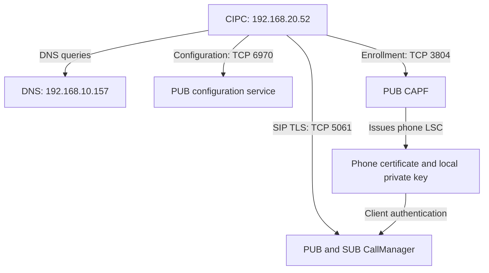

# SIP over TLS with CIPC: a student lab

A standalone SIP/TLS learning repository reconstructed from the September 2026 HQ India lab. Start here even if you have never read the separate UDP repository.

**Result:** after installing its LSC, CIPC completed mutual TLS handshakes with PUB and SUB and exchanged encrypted application data. The operator reported successful registration. The encrypted capture alone does not reveal REGISTER/200 OK, establish the active node, or prove SRTP audio.

**Compatibility boundary:** this is observed interoperability of legacy CIPC 8.6.6.0 on Windows 11 with CUCM 14. It is not a supported-platform certification or a modern production security recommendation. The captured connection negotiated TLS 1.0 and an RSA/CBC cipher. Do not weaken an existing production cluster to reproduce it; use an isolated legacy lab or a supported modern endpoint.

## Begin here — do these in order

1. [Prepare network, routing, time, device pool and user](docs/00-foundation.md).
2. [Run CLI checks; decide whether mixed mode is needed; verify PUB/SUB](docs/08-command-runbook.md).
3. [Understand CAPF 3804, HTTP 6970, CTL and LSC](docs/09-capf-trust-and-ports.md).
4. [Create/apply the security profile, phone, line and CAPF operation](docs/01-deployment.md).
5. Launch with capture running, submit LSC authentication string, then follow the failure/success cases below.
6. [Check coverage of the original work and evidence limits](docs/10-session-coverage.md).

**CAPF uses TCP 3804 in this lab—not 3084.** Mixed mode and CTL prepare cluster trust; enrollment separately installs the phone LSC; SIP TLS separately connects to 5061.

## Learning path

| Read in order | What you will learn |
|---|---|
| [1. Deployment, with field-by-field purpose](docs/01-deployment.md) | Network, CUCM objects, mixed mode, phone profile, CAPF enrollment and final checks |
| [2. Ports and technical glossary](docs/02-ports-and-glossary.md) | CAPF, LSC, CTL, CTI, TLS, SIP and the roles of each port |
| [3. Failed enrollment-state case](docs/03-failed-case.md) | Why a downloaded secure configuration still produced a plain TCP REGISTER and 403 |
| [4. Successful TLS case](docs/04-success-case.md) | How client certificates, CertificateVerify and Finished establish mutual TLS |
| [5. Wireshark workbook](docs/05-wireshark-workbook.md) | Filters, packet reading, test questions and troubleshooting decisions |
| [6. Operations and recovery](docs/06-operations.md) | Reboots, failover, port conflicts, renewal and evidence collection |
| [Sources and evidence boundaries](docs/07-sources.md) | Cisco, IANA, Wireshark and what was actually observed |

## Lab identity map

| Component | Value used in this guide |
|---|---|
| PUB / configuration server / CAPF | cucm-pub.ccie.collab — 192.168.10.150 |
| SUB / alternate call processor | cucm-sub.ccie.collab — 192.168.10.151 |
| AD/DNS | 192.168.10.157 |
| PC3 | HQ-PC3-TLS — 192.168.20.52/24 |
| Gateway | 192.168.20.1 |
| Generic MAC | **02:00:00:00:03:01** — example only |
| Generic CUCM device name | **SEP020000000301** — example only |
| User / line | ONPREM / 2103 in PT-HQ-INTERNAL |
| Device pool / group | DP-HQ-INDIA / CMG-HQ-LAB |
| Final profile | SIP-Profile-TLS-Encrypted |

Use your own stable adapter identity when configuring a real phone. MAC → remove separators → prefix SEP. The example MAC is locally administered and is not the original adapter MAC.

## What has been anonymized

Every new device MAC/name, certificate subject device identity, issuer identifier, certificate serial, fingerprint/hash and authentication-string example is synthetic or omitted. The lab IPs, object names and ONPREM label are retained for continuity. Raw PCAPs, screenshots, certificate files, PINs and private keys are not published.

The [failure example](examples/failure.json) and [success example](examples/success.json) are **teaching records, not importable certificates or configuration files**. A missing LSC has no certificate serial or fingerprint; inventing a “failed certificate value” would misrepresent the evidence.

Frame numbers in the case studies refer to the two private source captures. They are not universal Wireshark packet numbers. Students can reproduce the sequence with their own capture using the workbook filters.

## Architecture

CAPF enrollment, configuration download, and SIP registration are different conversations. CTIManager is not in this phone-to-CallManager TLS path.
