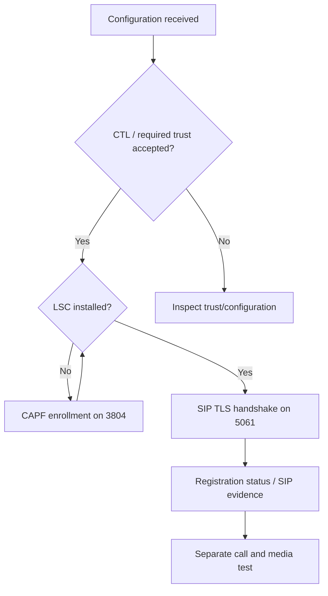

# CAPF, CTL and ports: why they exist and where to look

[Start](../README.md) · [Full glossary](02-ports-and-glossary.md) · [Runbook](08-command-runbook.md)

## First correct the two names

- **CAPF** = Certificate Authority Proxy Function, not CPAF.
- The lab's CAPF endpoint is **TCP 3804**, not 3084. The screenshot showed `192.168.10.150:3804`; the successful capture used that destination.

Port numbers identify configured service endpoints. They are not secret keys and do not intrinsically make traffic secure. A TCP handshake to a port only proves a TCP connection; the subsequent protocol determines what happened.

## Why does this phone need CAPF?

CUCM's secure-phone workflow needs the client to demonstrate an identity bound to a private key. A device name and DN in a downloaded XML file are not that proof. CAPF enrolls a **Locally Significant Certificate (LSC)** for the phone. The certificate contains a public key and identity signed by the issuing authority; the phone retains its private key.

The administrator arms Install/Upgrade and supplies an enrollment authentication method. In this exercise, a generated **authentication string** authorizes the enrollment attempt. The phone later uses its LSC/private key in the SIP TLS handshake. The CAPF string is not sent as a SIP password on every call, and it is not the private key.

After enrollment, ordinary SIP signaling uses CallManager 5061. CAPF 3804 does not carry every call and need not maintain a permanent phone connection. Closing an enrollment connection after work finishes is not automatically a certificate failure.

## Port 3804: CAPF enrollment

| Question | Answer in this lab |
|---|---|
| Who initiates? | CIPC on 192.168.20.52 |
| Who listens? | CAPF on PUB 192.168.10.150 |
| Transport? | TCP, with TLS observed for the enrollment conversation |
| When? | During LSC install/upgrade, after configuration and the operator's enrollment action |
| Where is it visible? | CUCM Enterprise Parameters → Security Parameters → CAPF Phone Port; CIPC Security Configuration → CAPF Server |
| What was configured? | CAPF Phone Port 3804, endpoint .150:3804 |
| What is typed on CIPC? | The generated CAPF authentication string under LSC → Update; not an IP:port or fingerprint |
| Filter? | `ip.addr == 192.168.20.52 && tcp.port == 3804` |
| Failure capture? | No PC3 packets to 3804 |
| Success capture? | Frame 363 opens the first connection; protected CAPF exchange follows |

Do not change the CAPF Phone Port simply because someone typed “3084.” It must agree across the server, delivered configuration and network policy. Keep the working value 3804 in this lab.

## Port 6970: configuration delivery

CIPC needs its CUCM-generated configuration before it knows the final DN, CM server list, profile/security settings and CAPF location. CUCM's configuration distribution service supplied these resources through **HTTP TCP 6970** in the captures, even though CIPC labels the server field **TFTP Servers**.

| Question | Answer in this lab |
|---|---|
| Who initiates? | PC3 .20.52 |
| Who listens? | PUB .10.150 configuration distribution service |
| How is the server selected? | CIPC Preferences → Network → TFTP Server 1 = .10.150; DHCP option 150 is another provisioning design |
| What files were requested? | CTL and signed phone configuration; additional directory/dial-rule/softkey resources |
| Do I enter 6970 as the SIP Phone Port? | No. SIP TLS uses 5061. The configuration service chooses its own transport endpoint |
| Does HTTP 200 mean registration succeeded? | No, it means the request returned a successful HTTP response |
| Does .sgn mean encrypted? | No. A signature protects authenticity/integrity; content can remain readable |
| Does manual TFTP .150 pin call processing to PUB? | No. The downloaded CM group contains the call-processing candidates |
| Filter? | `ip.addr == 192.168.20.52 && tcp.port == 6970` |

Illustrative requests (generic identity, not commands students need to type):

```http
GET /CTLSEP020000000301.tlv HTTP/1.1
Host: 192.168.10.150:6970

GET /SEP020000000301.cnf.xml.sgn HTTP/1.1
Host: 192.168.10.150:6970
```

The earlier failure still successfully downloaded CTL and signed configuration. That success narrowed troubleshooting toward enrollment/transport instead of making HTTP 6970 the culprit. Optional directory/dial-rule 404 responses did not explain the explicit SIP 403 transport warning.

If the actual client instead uses TFTP, expect initial UDP 69 and then negotiated UDP transfer ports. Capture broadly enough to include the selected mechanism. Do not conclude “no configuration download” from an empty `tftp` filter alone.

## Port 5061: SIP TLS after enrollment

The successful example opened:

| Client socket | Server socket | Purpose |
|---|---|---|
| 192.168.20.52:56153 | 192.168.10.150:5061 | PUB TLS connection |
| 192.168.20.52:56154 | 192.168.10.151:5061 | SUB TLS connection |

56153/56154 were transient source ports from that run. They are not settings to copy. The security profile's TLS/5061 choice does not require every client-originated connection to bind local 5061.

CUCM requested a client certificate. CIPC sent its LSC and CertificateVerify; completed handshakes and protected data followed. This is stronger evidence than a mere SYN or a “TLS” line label. Encrypted records cannot be labeled REGISTER/200 OK by size alone.

## CTIManager: different application, different job

**CTIManager** lets telephony applications monitor/control devices and calls through interfaces such as JTAPI/TAPI. In the self-provisioning workflow, the application controls **CTIRP-SELFPROV / 2099**. **Standard CTI Enabled** belongs on the relevant application user when required. It is not an LSC installation permission for an ordinary CIPC end user.

Conventional CTI application connections use TCP **2748** nonsecure and **2749** secure, subject to configuration. A phone's SIP TLS connection uses **5061**, and CAPF enrollment uses **3804**. Restarting CTIManager can be part of a cluster security change's instructed service restart sequence without making it the server processing the phone's SIP REGISTER.

[Official Cisco CTI security explanation](https://www.cisco.com/c/en/us/td/docs/voice_ip_comm/cucm/security/14SU2/cucm_b_security-guide-14su2/cucm_b_security-guide-1251SU2_chapter_010101.html).

## CTL versus LSC versus HTTPS browser trust

| Item | Question it answers | Where checked | What it does not prove |
|---|---|---|---|
| Cluster mode | Is secure-phone capability enabled in this workflow? | Enterprise Parameters, mode 1 | Individual phone has a certificate |
| CTL | Which cluster identities/roles should this phone trust? | CUCM show ctl; CIPC CTL state | LSC Installed or SIP accepted |
| LSC | What certified identity can this phone present? | CIPC LSC; CAPF status; client Certificate | Correct call permissions or media routing |
| CallManager certificate | What identity does this call processor present? | Server Certificate in 5061 handshake | Browser/Tomcat certificate has the same identity/chain |
| CAPF certificate | Which enrollment service/issuer is involved? | CAPF handshake/certificate management | Phone submitted a correct string |
| Browser HTTPS certificate/trust | Does the browser trust the CUCM web endpoint? | Browser connection and Windows trust store | CIPC has CTL/LSC or trusts CallManager signaling |

Installing an AD root CA through GPO fixed browser trust in the earlier work; it did not itself install CIPC's LSC. HTTPS by FQDN and HTTPS by IP also perform different name checks. DNS A/PTR records do not add an IP Subject Alternative Name to a certificate. These browser checks and SIP mutual TLS must be diagnosed separately.

## A complete chain of evidence



This diagram shows dependencies, not a claim every startup performs fresh enrollment. An existing valid LSC can be reused; cached files may also affect what appears in a restart trace.
